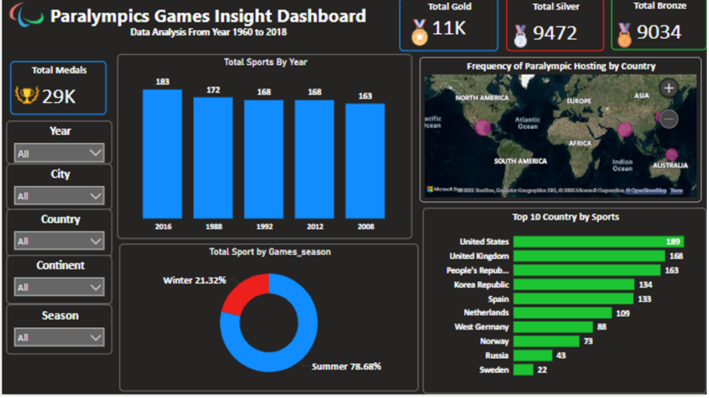
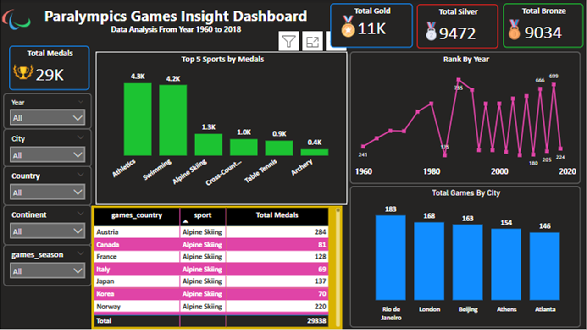

# 🏅 Paralympics Power BI Dashboard

This project presents an interactive Power BI dashboard built using historical data from the **Paralympic Games (1960–2018)**. It analyzes over 29,000 medals awarded to athletes across countries, continents, and sports disciplines.

> ✅ **This project is my final submission for the Power BI course at IRA Skills**.

---

## 📊 Project Objective

The goal of this dashboard is to explore and visualize trends and insights from the Paralympic Games, helping viewers understand:

- Which countries and continents dominated over time
- City-wise distribution of medals
- Popular sports in Summer and Winter Paralympics
- Trends across different years and seasons

---

## 📌 Key Features

- ✅ Interactive filters: Year, Season, Country, City, Continent
- ✅ Visuals Used:
  - Clustered Column Chart
  - Pie Chart
  - Stacked Bar Chart
  - Tree Map
  - Table
- ✅ Clear layout with intuitive navigation
- ✅ Logical data modelling for seamless interaction

---

## 🛠️ Tools & Technologies Used

- **Power BI Desktop**
- **DAX (Data Analysis Expressions)**
- **Data Modelling**
- **Slicers & Filters**
- **Custom Visuals**

---

## 📂 Project Files

- `Paralympics_Dash.pbix` – Power BI dashboard file
- `Paralympics_Dataset.xlsx` – Cleaned dataset used for analysis (if available)
- `README.md` – This documentation file

---

## 📷 Dashboard Preview

  

---

## 📈 Insights Highlighted

- Medal trends from 1960 to 2018
- Comparison between Summer and Winter Paralympics
- Most awarded sports categories
- Dominating countries by medal count
- City and continent-level medal distribution

---

## 📣 About Me

Hi, I'm **Rukhsar Bano**, a budding data analyst passionate about storytelling with data.  
This is one of my Power BI portfolio projects created during my training at **IRA Skills**.

🔗 [Connect with me on LinkedIn] : www.linkedin.com/in/rukhsar-bano-05373b24 

---

## 📬 Feedback & Suggestions

I’d love to hear your thoughts!  
If you have any suggestions or ideas for improvement, feel free to open an issue or connect with me directly.

---

## 🔖 License

This project is for educational and portfolio purposes only.

